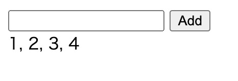

# Classic MVC and Reactive Programming, part 1

I recently found that `Observable` in [RxJS](https://rxjs-dev.firebaseapp.com/) is used as an event emitter in many places. From my point of view, `Observable` is kind of a value whose actual value changes synchronously or asynchronously.

I thought that I can demonstrate it by implementing a simple application with both classic MVC and RxJS, and compare them.

The application is pretty simple. It has one number input and a button, and displays a series of numbers you put into it. I'll add some more functionalities gradually in the following posts.




Let's implement this using classic MVC. We'll define `Model` which manages values, `ModelListener` and `ModelEvent` to send events from `Model` to its listeners.

```
class Model {
    get values(): number[] {
        return [...this._values];
    }

    addValue(value: number): void {
        this._values.push(value);
        this.fireUpdated();
    }

    addListener(listener: ModelListener): void {
        this._listeners.push(listener);
    }

    private fireUpdated(): void {
        const event = new ModelEvent(this);
        this._listeners.forEach(listener => listener.updated(event));
    }

    private _values: number[] = [];
    private _listeners: ModelListener[] = [];
}

class ModelEvent {
    constructor(readonly model: Model) {}
}

interface ModelListener {
    updated(event: ModelEvent): void;
}
```

The controller listens to events from a model, and update views.

```
class Controller {
    constructor(model: Model, document: HTMLDocument) {
        const $value = document.getElementById('value') as HTMLInputElement;
        const $add = document.getElementById('add') as HTMLInputElement;
        const $view = document.getElementById('view') as HTMLInputElement;

        $add.addEventListener('click', () => {
            if ($value.value.length > 0) {
                const v = Number($value.value);
                if (!isNaN(v)) {
                    model.addValue(v);
                }
            }
            $value.value = '';
        });

        model.addListener({
            updated(event: ModelEvent): void {
                $view.innerText = event.model.values.join(', ');
            }
        });
    }
}
```

Now, we'll create a model and a controller.

```
new Controller(new Model(), document);

```

This is pretty straightforward. How can you implement it using RxJS?

The first thing you need to do is to create an `Observable` using `fromEvent`, then convert each event to a series of values.

```
const values$ = fromEvent($add, 'click')
    .pipe(
        map(() => $value.value),
        filter(value => value.length > 0),
        map(value => Number(value)),
        filter(value => !isNaN(value)),
        scan((values, value, _) => [...values, value], [] as number[])
    );
```

This `values$` will be `[1]` when you input `1`, then will be `[1, 2]` after you input `2`, and so on. You can think this `values$` represents the values you've inputted so far and the values will change on-the-fly. Don't think this just as an event emitter.

Once you've subscribe to it, you can get the values to update views.

```
values$.subscribe(values => {
    $view.innerText = values.join(', ');
    $value.value = '';
});
```

You can find the complete code at [snakamura/mvc_rx](https://github.com/snakamura/mvc_rx/tree/master/1).

In the following posts, I'll add some more features, such as saving, loading values to this application, and see how it'll be implemented using both classic MVC and RxJS.
